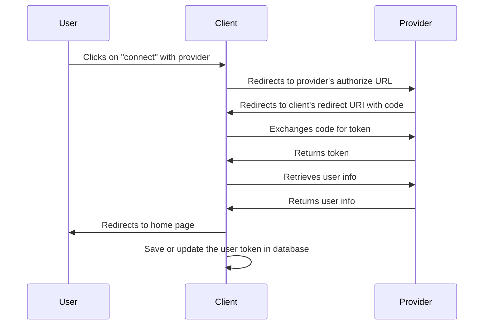

# OAuth2 Token Capture for Django

This Django package that enables easy capture of OAuth2 tokens for the following
providers:

- X (Twitter)
- LinkedIn
- GitHub
- Reddit
- Pinterest
- Facebook
- Threads

## Planned

- Instagram
- Youtube
- TikTok

---

## Features

- OAuth2 token exchange
- User information retrieval
- Support for multiple providers
- Easily extendable to support new providers
- Manage multiple tokens for different users and providers

---


https://youtube.com/@leftsideresale?si=b7Be0pEbJGA57Y7J


## Requirements

- Python 3.6+
- Django 3.0+
- requests

You will also need to setup an OAuth2 application with each provider you want to
use. This will give you a client ID and client secret that you will need to
configure the package.

---

## Installation

Install the package using pip:

```bash
pip install oauth2_capture
```
or while in development mode:
```bash
pip install -e .
```

or from another project, make sure to follow HEAD on master from https://github.com/heysamtexas/django-oauth2-capture:

```bash
pip install git+https://github.com/yourusername/django-oauth2-capture.git@master
```

---

## Configuration
Add it to your installed apps in your Django settings file:
```python
INSTALLED_APPS = [
    ...
    'oauth2_capture',
    ...
]
```

---

## OAuth2 Configuration

You need to configure the OAuth2 providers in your Django settings file by adding the `OAUTH2_CONFIG` dictionary. Each provider requires specific configuration parameters:

```python
OAUTH2_CONFIG = {
    "twitter": {
        "client_id": os.environ["TWITTER_CLIENT_ID"],
        "client_secret": os.environ["TWITTER_CLIENT_SECRET"],
        "scope": "tweet.read users.read tweet.write offline.access",
        "code_verifier": "challenge",  # Twitter-specific parameter
    },
    "linkedin": {
        "client_id": os.environ["LINKEDIN_CLIENT_ID"],
        "client_secret": os.environ["LINKEDIN_CLIENT_SECRET"],
        "scope": "profile email openid w_member_social",
    },
    "github": {
        "client_id": os.environ["GITHUB_CLIENT_ID"],
        "client_secret": os.environ["GITHUB_CLIENT_SECRET"],
        "scope": "user repo issues write:discussion",
    },
    "reddit": {
        "client_id": os.environ["REDDIT_CLIENT_ID"],
        "client_secret": os.environ["REDDIT_CLIENT_SECRET"],
        "scope": "identity edit read submit save",
    },
    "pinterest": {
        "client_id": os.environ["PINTEREST_CLIENT_ID"],
        "client_secret": os.environ["PINTEREST_CLIENT_SECRET"],
        "scope": "user_accounts:read boards:read_secret boards:read boards:write_secret boards:write pins:read pins:write pins:read_secret pins:write_secret",
    },
}
```

---

## Usage

The package provides views and models to handle OAuth2 authentication and token storage. Here's a basic implementation:

1. Include the OAuth2 URLs in your project's `urls.py`:

```python
from django.urls import include, path

urlpatterns = [
    # ... your other URL patterns
    path('oauth2/', include('oauth2_capture.urls')),
]
```
2. Create links to the OAuth2 authorization endpoints for your desired providers:

```html
<a href="">Connect with GitHub</a>
<a href="">Connect with Twitter</a>
<a href="">Connect with LinkedIn</a>
<!-- Add more providers as needed -->
```

3. Handle the callback and access the tokens in your views:

```python
from oauth2_capture.models import OAuth2Token

def my_view(request):
    # Get a user's GitHub token
    token = OAuth2Token.objects.filter(
        user=request.user,
        provider='github'
    ).first()

    if token:
        # Use the token to make API requests
        access_token = token.access_token
        # ...
```

For more detailed examples, check out the demo app in the development/ directory of the repository, which shows complete implementation examples for all supported providers.

---

## Adding a new provider
```python
class NewProviderOAuth2Provider(OAuth2Provider):
    @property
    def authorize_url(self) -> str:
        return "https://newprovider.com/oauth/authorize"

    @property
    def token_url(self) -> str:
        return "https://newprovider.com/oauth/token"

    @property
    def user_info_url(self) -> str:
        return "https://api.newprovider.com/userinfo"

    def get_user_info(self, access_token: str) -> dict:
        headers = {"Authorization": f"Bearer {access_token}"}
        response = requests.get(self.user_info_url, headers=headers, timeout=10)
        return response.json()

    def exchange_code_for_token(self, code: str, redirect_uri: str) -> dict:
        data = {
            "grant_type": "authorization_code",
            "code": code,
            "redirect_uri": redirect_uri,
            "client_id": self.config["client_id"],
            "client_secret": self.config["client_secret"],
        }
        headers = {"Content-Type": "application/x-www-form-urlencoded"}
        response = requests.post(self.token_url, data=data, headers=headers, timeout=10)
        return response.json()
```

---

## User Flow

The following is a simplified user flow for how we obtain and save the oauth
tokens. The flow is as follows:


Note: if the user is not logged in at their provider, they will be prompted to
login before they can authorize the client. (This is not shown in the diagram)

---

## Setting up your development environment

1. Clone the repository
2. Create a virtual environment
3. Install the requirements
4. Configure the environment variables
   1. Acquire the client ID and client secret from the providers
   2. Put client_id and secrets into local `env` file in the `development/`
      folder
5. Migrate the database with `python manage.py migrate`

Setup each provider by following the instructions in the `docs/` folder.
- [LinkedIn](docs/linkedin-setup.md)

---

## License

- see [LICENSE](LICENSE) file

---

## Appendix

### Provider's endpoints, docs, etc

- [Twitter](https://developer.twitter.com/en/docs/authentication/oauth-2-0)
- [LinkedIn](https://docs.microsoft.com/en-us/linkedin/shared/authentication/authorization-code-flow?context=linkedin/context)
- [GitHub](https://docs.github.com/en/developers/apps/building-oauth-apps/authorizing-oauth-apps)
- [Reddit](https://github.com/reddit-archive/reddit/wiki/OAuth2)
- [Pinterest](https://developers.pinterest.com/docs/getting-started/connect-app/)
- [Facebook](https://developers.facebook.com/docs/facebook-login/web)
