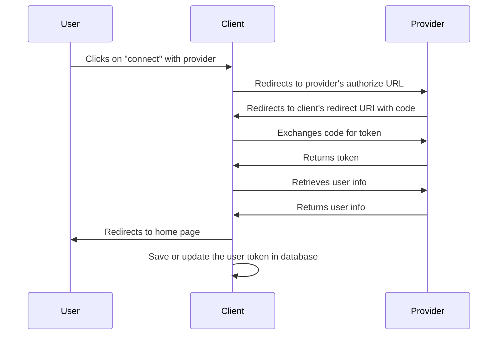

# OAuth2 Token Capture for Django

This Django package that enables easy capture of OAuth2 tokens from various
providers like X (Twitter), LinkedIn, and GitHub.

## Features

- OAuth2 token exchange
- User information retrieval
- Support for multiple providers
- Easily extendable to support new providers

## Requirements

- Python 3.6+
- Django 3.0+
- requests

You will also need to setup an OAuth2 application with each provider you want to
use. This will give you a client ID and client secret that you will need to
configure the package.

## Installation

Install the package using pip:

```bash
pip install oauth2_capture
```
or while in development mode:
```bash
pip install -e .
```

or from another project, make sure to follow HEAD on master from https://github.com/heysamtexas/django-oauth2-capture:
```bash
pip install git+https://github.com/yourusername/django-oauth2-capture.git@master
```

## Configuration
Add it to your installed apps in your Django settings file:
```python
INSTALLED_APPS = [
    ...
    'oauth2_capture',
    ...
]
```

## Usage
- TODO

## Adding a new provider
```python
class NewProviderOAuth2Provider(OAuth2Provider):
    @property
    def authorize_url(self) -> str:
        return "https://newprovider.com/oauth/authorize"

    @property
    def token_url(self) -> str:
        return "https://newprovider.com/oauth/token"

    @property
    def user_info_url(self) -> str:
        return "https://api.newprovider.com/userinfo"

    def get_user_info(self, access_token: str) -> dict:
        headers = {"Authorization": f"Bearer {access_token}"}
        response = requests.get(self.user_info_url, headers=headers, timeout=10)
        return response.json()

    def exchange_code_for_token(self, code: str, redirect_uri: str) -> dict:
        data = {
            "grant_type": "authorization_code",
            "code": code,
            "redirect_uri": redirect_uri,
            "client_id": self.config["client_id"],
            "client_secret": self.config["client_secret"],
        }
        headers = {"Content-Type": "application/x-www-form-urlencoded"}
        response = requests.post(self.token_url, data=data, headers=headers, timeout=10)
        return response.json()
```

## User Flow

The following is a simplified user flow for how we obtain and save the oauth
tokens. The flow is as follows:


Note: if the user is not logged in at their provider, they will be prompted to
login before they can authorize the client. (This is not shown in the diagram)

## Setting up your development environment

1. Clone the repository
2. Create a virtual environment
3. Install the requirements
4. Configure the environment variables
   1. Acquire the client ID and client secret from the providers
   2. Put client_id and secrets into local `env` file in the `development/`
      folder
5. Migrate the database with `python manage.py migrate`

```bash


## License

- see [LICENSE](LICENSE) file


## Appendix

### Provider's endpoints, docs, etc

- [Twitter](https://developer.twitter.com/en/docs/authentication/oauth-2-0)
- [LinkedIn](https://docs.microsoft.com/en-us/linkedin/shared/authentication/authorization-code-flow?context=linkedin/context)
- [GitHub](https://docs.github.com/en/developers/apps/building-oauth-apps/authorizing-oauth-apps)
- [Reddit](https://github.com/reddit-archive/reddit/wiki/OAuth2)
