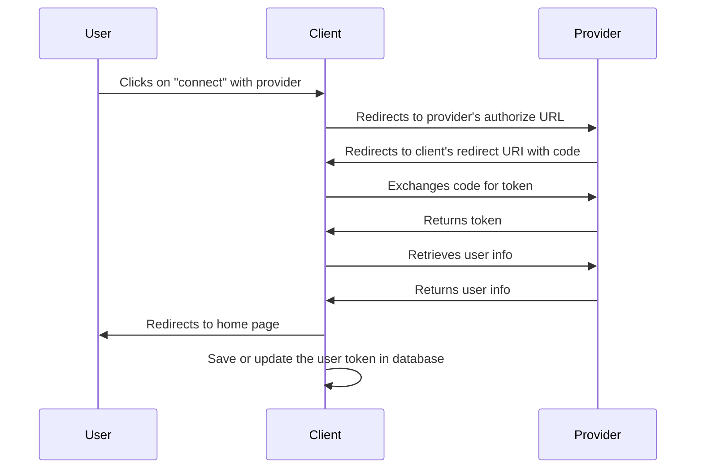

# Django OAuth2 Token Capture

This Django package enables easy capture of OAuth2 tokens from various providers like LinkedIn and GitHub.

## Features

- OAuth2 token exchange
- User information retrieval
- Support for multiple providers

## Installation

Install the package using pip:

```bash
pip install django-oauth2-token-capture
```

## Configuration
```python
INSTALLED_APPS = [
    ...
    'django_oauth2_token_capture',
    ...
]
```

## Usage
- TODO

## Adding a new provider
```python
class NewProviderOAuth2Provider(OAuth2Provider):
    @property
    def authorize_url(self) -> str:
        return "https://newprovider.com/oauth/authorize"

    @property
    def token_url(self) -> str:
        return "https://newprovider.com/oauth/token"

    @property
    def user_info_url(self) -> str:
        return "https://api.newprovider.com/userinfo"

    def get_user_info(self, access_token: str) -> dict:
        headers = {"Authorization": f"Bearer {access_token}"}
        response = requests.get(self.user_info_url, headers=headers, timeout=10)
        return response.json()

    def exchange_code_for_token(self, code: str, redirect_uri: str) -> dict:
        data = {
            "grant_type": "authorization_code",
            "code": code,
            "redirect_uri": redirect_uri,
            "client_id": self.config["client_id"],
            "client_secret": self.config["client_secret"],
        }
        headers = {"Content-Type": "application/x-www-form-urlencoded"}
        response = requests.post(self.token_url, data=data, headers=headers, timeout=10)
        return response.json()
```

## User Flow

The following is a simplified user flow for how we obtain and save the oauth
tokens. The flow is as follows:


Note: if the user is not logged in at their provider, they will be prompted to
login before they can authorize the client. (This is not shown in the diagram)

## License

- see [LICENSE](LICENSE) file
