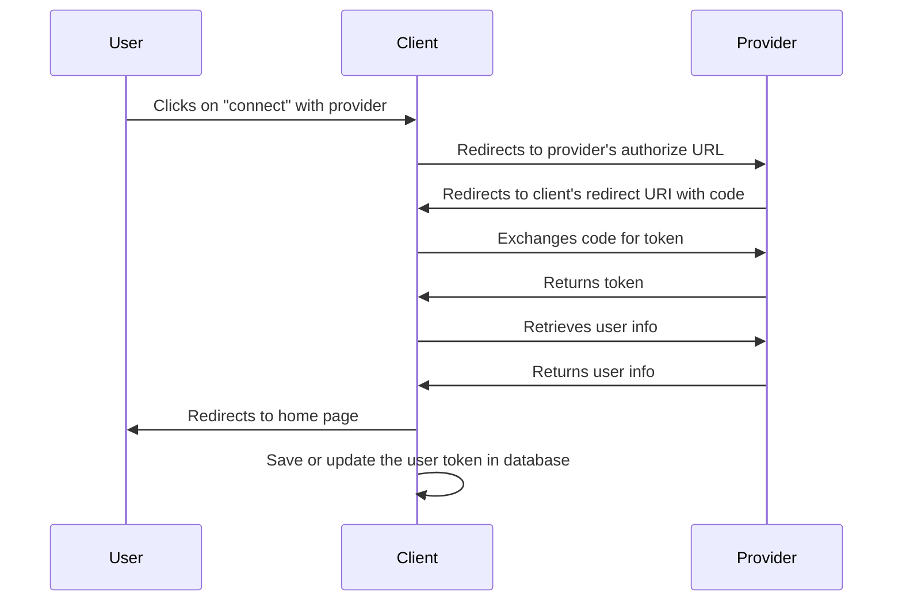

# OAuth2 Capture for Django

**Store and manage OAuth2 tokens for ongoing API access to social media platforms.**

Your Django app needs to post tweets for users. Your CRM creates GitHub repos in client organizations. Your marketing tool schedules LinkedIn posts for customers.

This package captures and manages the OAuth2 tokens that make these use cases possible.

## Who This Is For

✅ **Building social media management tools**
✅ **Creating GitHub integrations that act on behalf of users**
✅ **Need ongoing API access, not just authentication**

❌ **Just want social login for your Django app** → Use [django-allauth](https://github.com/pennersr/django-allauth) instead

## Supported Providers

- **Twitter/X** - Post tweets, read timelines, manage accounts
- **LinkedIn** - Share posts, manage company pages, access connections
- **GitHub** - Create repos, manage issues, access organization data
- **Reddit** - Post content, read feeds, manage subreddits
- **Pinterest** - Create pins, manage boards
- **Facebook** - Publish posts, manage pages (limited by Facebook policies)

*Planned: Instagram, YouTube, TikTok*

---

## What This Package Does vs django-allauth

**oauth2_capture** solves: *"I need my app to post tweets/LinkedIn updates FOR my users"*
- Your app posts to Twitter using Jane's account
- Your app creates GitHub repos in John's organizations
- Your app schedules LinkedIn posts for your marketing clients

**django-allauth** solves: *"I need users to log into my site with social accounts"*
- Users click "Login with Google" to access your Django app
- You create user profiles from their social account data
- You manage user sessions and permissions

**Can you use both?** Yes! allauth for login, oauth2_capture for API actions.

---


## Quick Start (5 minutes)

### 1. Install

```bash
uv add git+https://github.com/heysamtexas/django-oauth2-capture.git@master
```

### 2. Add to Django Settings

```python
INSTALLED_APPS = [
    ...
    'oauth2_capture',
    ...
]
```

### 3. Run Migrations

```bash
python manage.py migrate
```

### 4. Add URLs

```python
# urls.py
from django.urls import path, include

urlpatterns = [
    ...
    path('oauth2/', include('oauth2_capture.urls')),
    ...
]
```

### 5. Verify Setup

```bash
python manage.py check oauth2_capture
```
**Expected output**: "System check identified no issues"

**If error**: Check INSTALLED_APPS includes 'oauth2_capture'

---

## Provider Setup

Choose a provider to get started. Each requires different setup steps and credentials.

### Twitter (Recommended for beginners)

1. Create app at [developer.twitter.com](https://developer.twitter.com)
2. Copy Client ID and Secret
3. Add to settings:
   ```python
   OAUTH2_CONFIG = {
       "twitter": {
           "client_id": "your_twitter_client_id",
           "client_secret": "your_twitter_client_secret",
           "scope": "tweet.read users.read tweet.write offline.access",
           "code_verifier": "challenge",  # Required for Twitter
       }
   }
   ```
4. **Test**: Visit `/oauth2/twitter/connect/` - should redirect to Twitter

### GitHub (For development tools)

1. Go to GitHub Settings → Developer settings → OAuth Apps
2. Create new OAuth App with redirect URI: `http://localhost:8000/oauth2/github/callback/`
3. Add to settings:
   ```python
   OAUTH2_CONFIG = {
       "github": {
           "client_id": "your_github_client_id",
           "client_secret": "your_github_client_secret",
           "scope": "user repo",  # Minimal scopes to start
       }
   }
   ```

### LinkedIn (For business applications)

1. Create app at [LinkedIn Developer Portal](https://developer.linkedin.com/)
2. Request necessary permissions (may require approval)
3. Add to settings:
   ```python
   OAUTH2_CONFIG = {
       "linkedin": {
           "client_id": "your_linkedin_client_id",
           "client_secret": "your_linkedin_client_secret",
           "scope": "profile email openid w_member_social",
       }
   }
   ```

---

## Usage

### 1. Create Connection Links

```html
<a href="">Connect Twitter</a>
<a href="">Connect GitHub</a>
```

### 2. Access Tokens in Your Views

```python
from oauth2_capture.models import OAuth2Token

def my_view(request):
    # Get a user's GitHub token
    token = OAuth2Token.objects.filter(
        owner=request.user,
        provider='github'
    ).first()

    if token:
        # Use the token to make API requests
        access_token = token.access_token
        # ...
```

For more detailed examples, check out the demo app in the development/ directory of the repository, which shows complete implementation examples for all supported providers.

---

## Adding a new provider
```python
class NewProviderOAuth2Provider(OAuth2Provider):
    @property
    def authorize_url(self) -> str:
        return "https://newprovider.com/oauth/authorize"

    @property
    def token_url(self) -> str:
        return "https://newprovider.com/oauth/token"

    @property
    def user_info_url(self) -> str:
        return "https://api.newprovider.com/userinfo"

    def get_user_info(self, access_token: str) -> dict:
        headers = {"Authorization": f"Bearer {access_token}"}
        response = requests.get(self.user_info_url, headers=headers, timeout=10)
        return response.json()

    def exchange_code_for_token(self, code: str, redirect_uri: str) -> dict:
        data = {
            "grant_type": "authorization_code",
            "code": code,
            "redirect_uri": redirect_uri,
            "client_id": self.config["client_id"],
            "client_secret": self.config["client_secret"],
        }
        headers = {"Content-Type": "application/x-www-form-urlencoded"}
        response = requests.post(self.token_url, data=data, headers=headers, timeout=10)
        return response.json()
```

---

## User Flow

The following is a simplified user flow for how we obtain and save the oauth
tokens. The flow is as follows:


Note: if the user is not logged in at their provider, they will be prompted to
login before they can authorize the client. (This is not shown in the diagram)

---

## Setting up your development environment

1. Clone the repository
2. Create a virtual environment
3. Install the requirements
4. Configure the environment variables
   1. Acquire the client ID and client secret from the providers
   2. Put client_id and secrets into local `env` file in the `development/`
      folder
5. Migrate the database with `python manage.py migrate`

Setup each provider by following the instructions in the `docs/` folder.
- [LinkedIn](docs/linkedin-setup.md)

---

## License

- see [LICENSE](LICENSE) file

---

## Appendix

### Provider's endpoints, docs, etc

- [Twitter](https://developer.twitter.com/en/docs/authentication/oauth-2-0)
- [LinkedIn](https://docs.microsoft.com/en-us/linkedin/shared/authentication/authorization-code-flow?context=linkedin/context)
- [GitHub](https://docs.github.com/en/developers/apps/building-oauth-apps/authorizing-oauth-apps)
- [Reddit](https://github.com/reddit-archive/reddit/wiki/OAuth2)
- [Pinterest](https://developers.pinterest.com/docs/getting-started/connect-app/)
- [Facebook](https://developers.facebook.com/docs/facebook-login/web)
