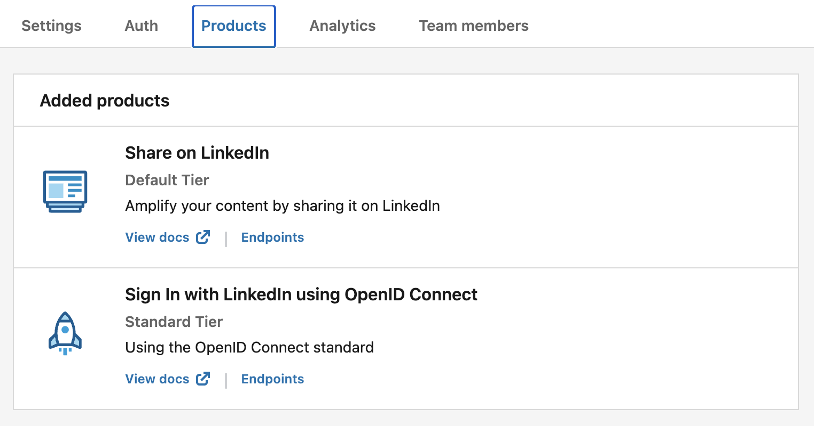

# Setup a LinkedIn application for use with OAuth2

1. Go to the [LinkedIn Developer Portal](https://www.linkedin.com/developers/apps)
2. Click on "Create App"
3. Fill in the required fields (App name, Company, etc.)
4. Under "Auth" tab, set the following:
   - **Redirect URLs**: `http://localhost:8000/oauth2/callback/linkedin/`
   - **OAuth 2.0 Scopes**: `profile email openid w_member_social`
5. Save your changes

You will need the **Client ID** and **Client Secret** from the app settings.

Once complete it should look like this in your LinkedIn developer portal:

# Screenshot

